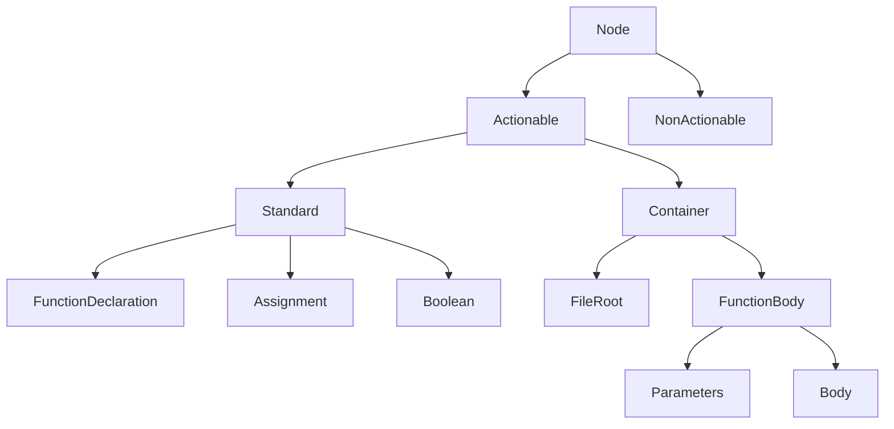

# atlantis_surveyor

Rust **cdylib** for Neovim ([nvim-oxi](https://github.com/noib3/nvim-oxi)) that probes **Neovim’s Tree-sitter** via **`luaeval()`** from `api::eval` (no second parser, no `mlua` / duplicate LuaJIT link on Windows). Returns an **`AnchorInfo`** table for Atlantis-style UIs.

## Requirements

- Neovim **0.11+** (matches `neovim-0-11` Cargo feature)
- **Rust** toolchain (`cargo`)
- On **Windows**: PowerShell for `build.ps1`. The crate does **not** enable nvim-oxi’s `mlua` feature so the DLL does not pull a second static LuaJIT (which conflicts with `nvim-oxi-luajit` when linking).

## Build

From this directory:

```bash
./build.sh    # Unix / macOS (copies to lua/native/atlantis_surveyor.so)
```

```powershell
.\build.ps1   # Windows → lua/native/atlantis_surveyor.dll
```

Lazy.nvim can run the same via the `build` key (see your `ui.lua` spec).

## Load

- `lua/atlantis_surveyor.lua` calls `package.loadlib` on `lua/native/atlantis_surveyor.{dll,so}` and exports `luaopen_atlantis_surveyor`.
- In Neovim: `require("atlantis_surveyor")` returns a table with `anchor` only. Optional `:SurveyorAnchor` is wired in Lazy config (see your `ui.lua`), not in the Rust plugin.

## Try it

In a buffer with Tree-sitter enabled:

```vim
:lua vim.print(require("atlantis_surveyor").anchor(0, vim.fn.line('.') - 1, vim.fn.col('.') - 1))
```

If you added `:SurveyorAnchor` in Lazy `config` (as in the bundled `ui.lua` example):

```vim
:SurveyorAnchor
```

`anchor(bufnr, row, col)` uses **0-based** `row` / `col` like `vim.treesitter.get_node({ pos = { row, col } })`. Use `bufnr == 0` for the current buffer.

## Layout

- `src/probe/treesitter/core/node.rs` — one `luaeval` chunk (parser, `get_node`, range, text); `treesitter/mod.rs` maps the table to `TsSnapshot`
- `src/probe/treesitter/` — `TsSnapshot` / parsing
- `src/prepare/` — `AnchorInfo`
- `src/endpoints/` — Lua-callable entrypoints

## Submodule (dotfiles)

To track this as its own Git repo under dotfiles, create `https://github.com/<you>/atlantis-surveyor` and run:

```bash
git submodule add https://github.com/<you>/atlantis-surveyor.git nvim/myPlugins/atlantis-surveyor
```

Then point Lazy’s `dir` at that path (or switch the spec to the Git URL once published).

## Node Hierarchy

Atlantis resolves Tree-sitter nodes into a structured hierarchy to provide consistent behavior across different languages.



- **Node**: The base type for all resolved Tree-sitter elements.
- **Actionable**: Nodes that support user interactions (jump, rename, etc.).
- **Standard**: Individual elements that act as a single unit.
- **Container**: Structural elements that contain other nodes (e.g., functions, classes, files).
